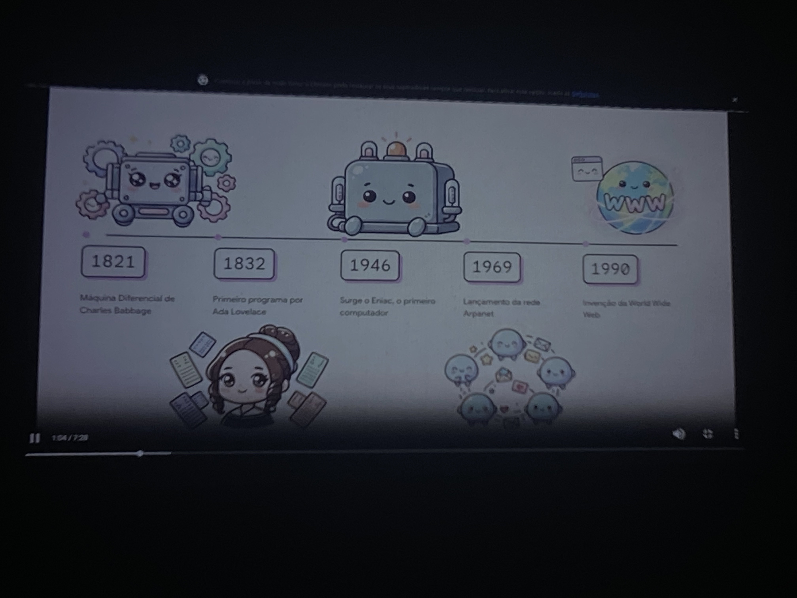
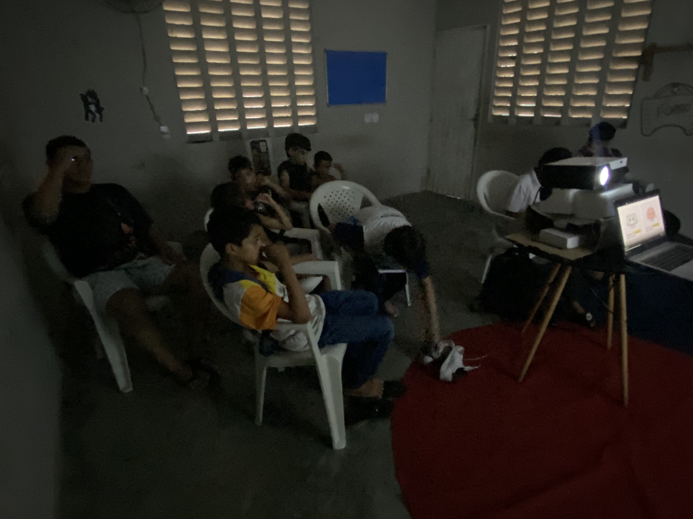
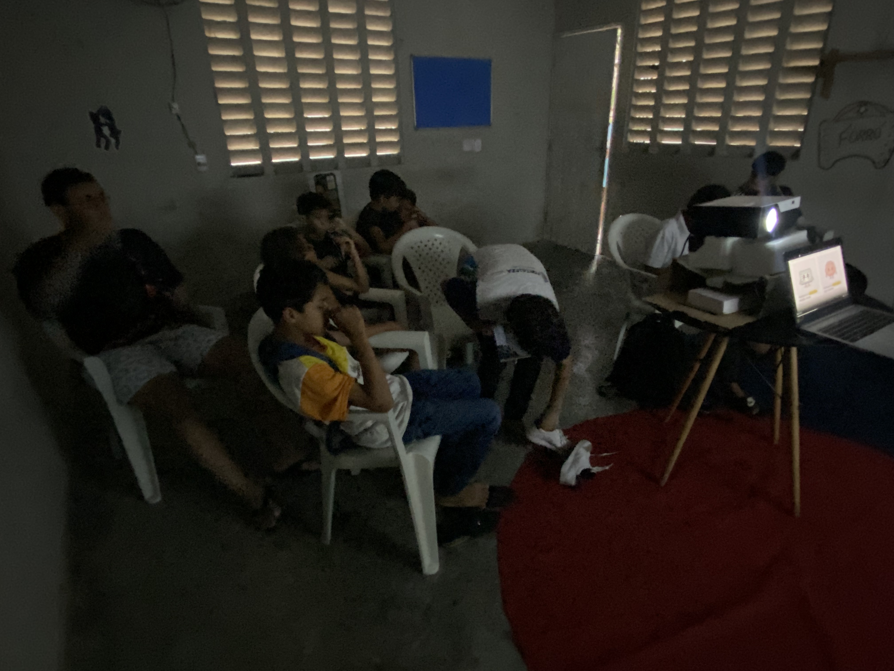
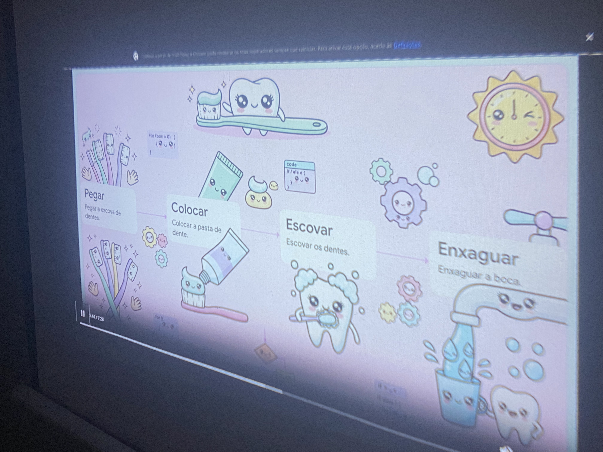
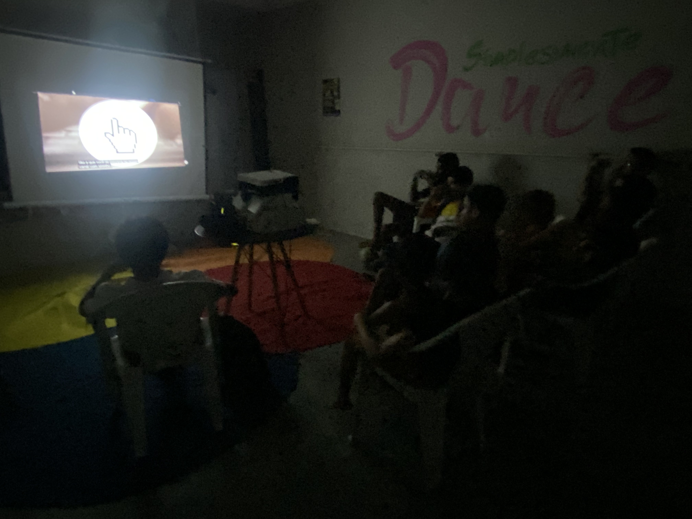
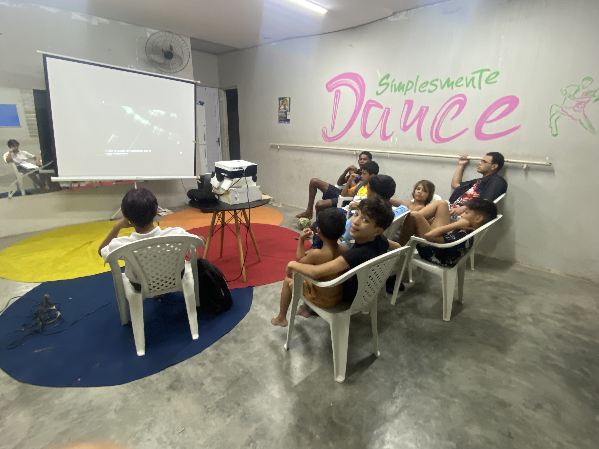
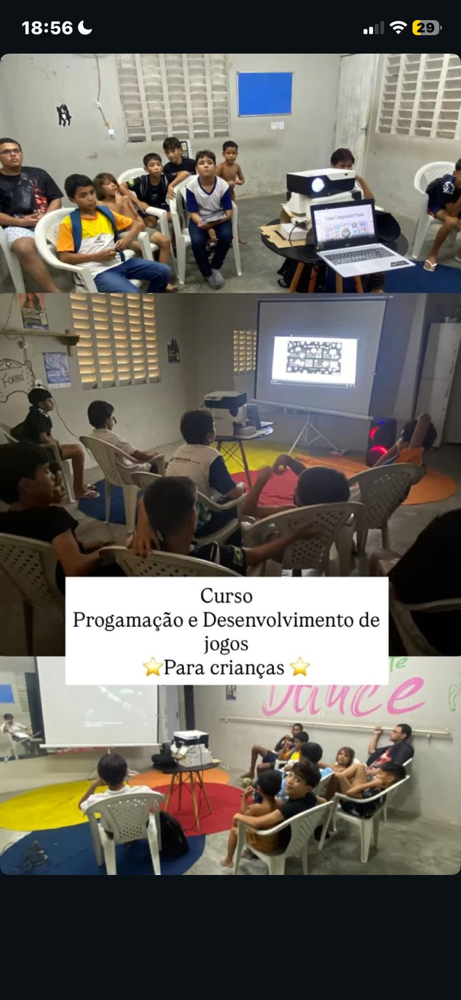

# 📷 Galeria do projeto

Este diretório reúne fotos reais da primeira aula do projeto, registrando o ambiente, os participantes e a dinâmica da atividade.

## Aula 01 — Registro visual

## Importância

As imagens ajudam a contar a história do projeto de forma concreta e emocionante, tornando a experiência mais autêntica para quem visita o repositório.
